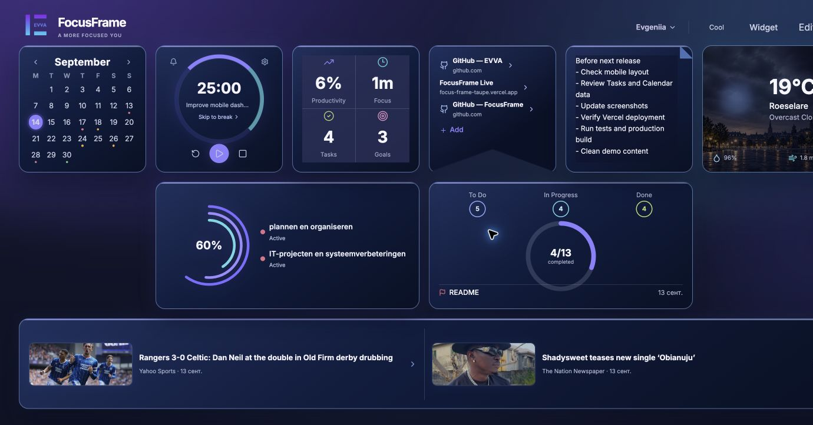
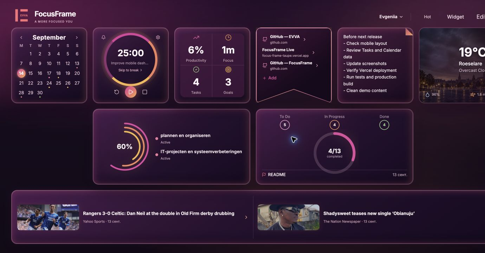
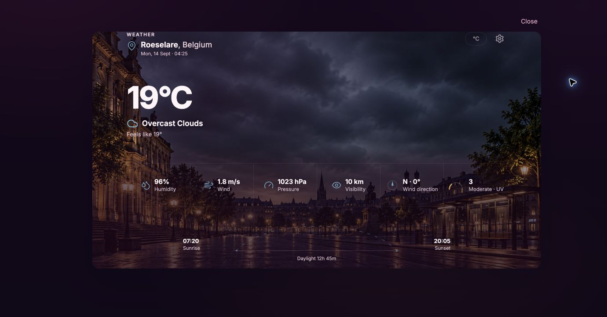
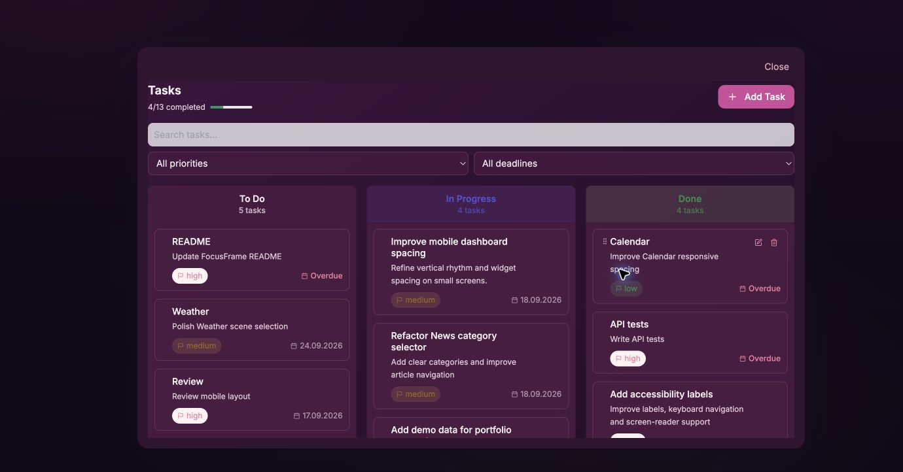
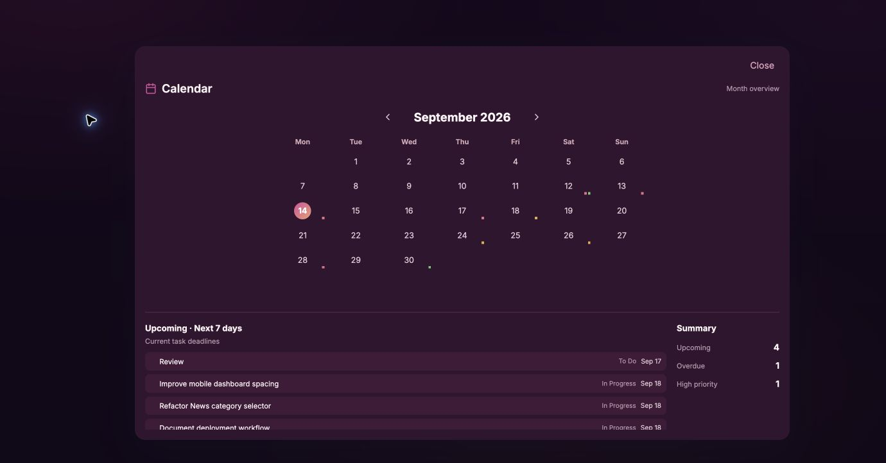
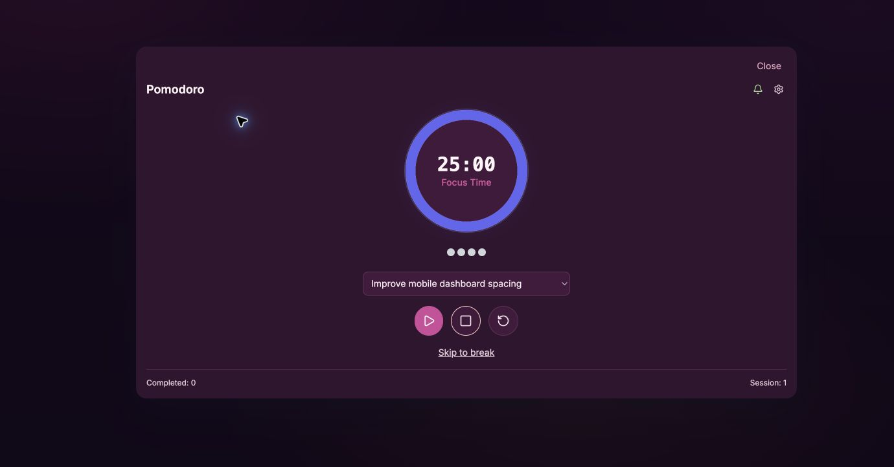
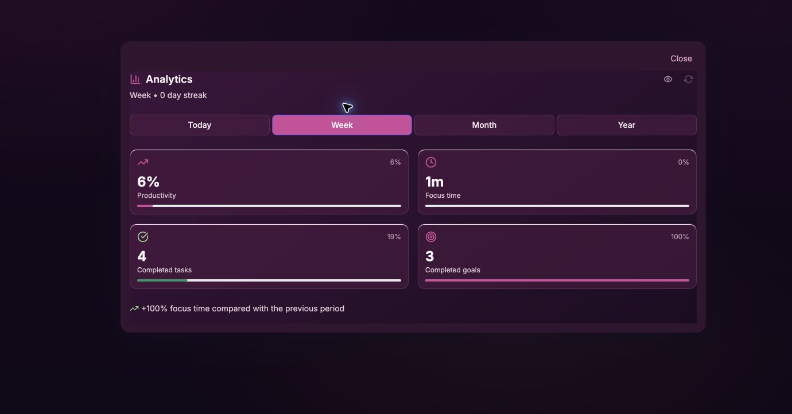
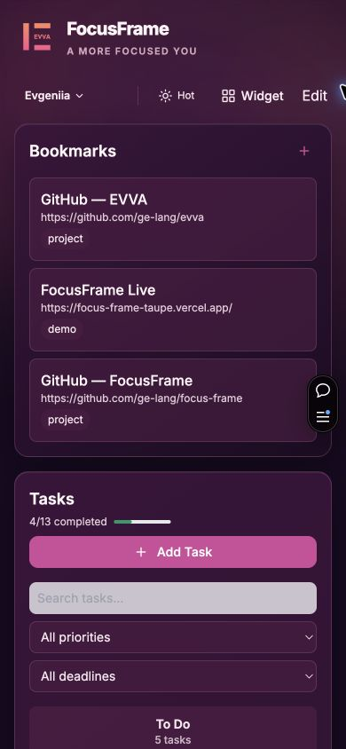
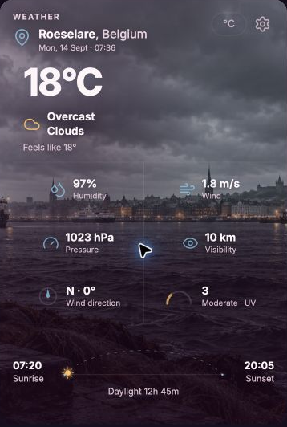

# FocusFrame

FocusFrame is a calm, visual workspace for turning intentions into focused progress. It brings tasks, Pomodoro sessions, notes, goals, analytics, calendar planning, bookmarks, news and weather into one adaptable dashboard.

**Live demo:** [focus-frame-taupe.vercel.app](https://focus-frame-taupe.vercel.app/)

## Product story

Most productivity tools separate planning from the conditions in which work actually happens. FocusFrame keeps the essentials in one glance: what needs attention, how much focus time is available, and the surrounding context that helps a day feel manageable. The interface is deliberately atmospheric and low-noise, while each widget can still open into a focused working view.

## What to explore

- A Google-authenticated personal workspace with user-scoped data.
- Draggable, persistent dashboard widgets with responsive desktop and mobile layouts.
- Tasks with status, priority, deadlines, search and filters.
- Pomodoro focus and break sessions, optionally linked to a task.
- Goals and analytics for completion, focus time, trends and streaks.
- Calendar month overview with deadline-aware summaries.
- Notes, bookmarks and live news in the same workspace.
- A cinematic Weather widget with condition-aware scenes, day/night treatment and detailed metrics.

## Screenshots

These are real renders from the authenticated production deployment.

### Dashboard themes





### Full widget views











### Mobile





## Technical highlights

- Next.js 16 App Router with React 19.
- TypeScript with Tailwind CSS for the visual system.
- React Grid Layout for persistent, draggable widget placement.
- TanStack React Query for client-side fetching and cache invalidation.
- NextAuth with Google OAuth and the Prisma adapter.
- Prisma ORM backed by PostgreSQL.
- Vitest and ESLint for automated quality checks.
- Vercel deployment with server-side integrations for weather and news.

## Architecture

React widgets render the dashboard and use focused hooks for query, mutation and local UI state. Next.js route handlers authenticate each request, validate payloads and scope reads and writes to the signed-in user before calling Prisma. The Weather and News routes proxy external services so API keys remain server-side; Weather composes condition-aware backgrounds, overlays and metrics without changing the underlying data model.

The deeper implementation notes remain in [docs/ARCHITECTURE.md](docs/ARCHITECTURE.md), with an interview-oriented walkthrough in [docs/PROJECT-WALKTHROUGH.md](docs/PROJECT-WALKTHROUGH.md).

## Authentication and data boundaries

The live demo requires Google sign-in. Server-side session identity is the source of truth for personal API routes; clients cannot select another user's ID through request data. Resource queries and mutations apply ownership checks, and external API secrets are never exposed with a `NEXT_PUBLIC_` prefix.

## Local setup

### Prerequisites

- Node.js 20 or newer
- PostgreSQL
- A Google OAuth application
- Optional GNews and OpenWeather API keys

### Install and configure

```bash
git clone https://github.com/ge-lang/focus-frame.git
cd focus-frame
npm ci
cp .env.example .env.local
```

Fill in the values in `.env.local`, then run:

```bash
npx prisma migrate dev
npm run dev
```

Open <http://localhost:3000>.

### Environment variables

| Variable | Required | Purpose |
| --- | --- | --- |
| `DATABASE_URL` | Yes | PostgreSQL connection string |
| `AUTH_SECRET` | Yes | NextAuth session secret |
| `NEXTAUTH_URL` | Yes | Application URL |
| `GOOGLE_CLIENT_ID` | Yes | Google OAuth client ID |
| `GOOGLE_CLIENT_SECRET` | Yes | Google OAuth client secret |
| `GNEWS_API_KEY` | No | Server-only GNews key |
| `OPENWEATHER_API_KEY` | No | Server-only OpenWeather key |

Never commit `.env.local`, and never use a `NEXT_PUBLIC_` prefix for server-only API keys.

## Quality

The current release candidate was verified with:

```bash
npx tsc --noEmit
npm run lint
npm test
npm run build
git diff --check
```

The suite contains 29 test files and 155 passing tests covering authentication and ownership, input validation, external API configuration, analytics helpers and task deadline/filter behavior. The production build also runs `prisma generate`; builds need network access when `next/font/google` downloads Inter.

## Status

FocusFrame is portfolio-ready on `main` and deployed at the live demo URL above. The demo is designed for an authenticated session and may show provider fallback states when optional external services are unavailable. Google OAuth is currently the configured sign-in provider, and `Task.userId` remains nullable for historical compatibility pending a separate data audit.

## License

MIT
