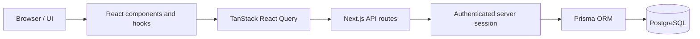
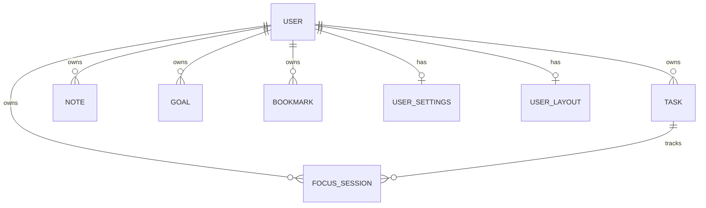

# FocusFrame architecture

## Request flow

The dashboard is a client-rendered React experience inside the Next.js App Router. Components and hooks call API routes with `fetch`; React Query manages server-state fetching, caching and invalidation for the personal resources that use it. The server gets the current user from NextAuth and uses Prisma to access PostgreSQL.

## Main model relationships

The Prisma schema defines the application data models and relationships. `UserSettings` stores focus and notification preferences. `UserLayout` stores the serializable dashboard widgets and layout. `FocusSession.taskId` is optional, so a session can be general or linked to a task.

## Authentication and ownership

Google OAuth is configured through NextAuth.js and the Prisma adapter. API routes use `getCurrentUserId()`, which reads the server session. They do not accept a caller-provided owner ID.

Ownership checks are important because an object ID is not a secret and should not be treated as proof of access. A user could guess an ID and try to update or delete it, so personal object queries verify both the object identifier and the authenticated `userId`, or first verify that a related object belongs to that user. A missing or foreign object is returned as a controlled not-found response rather than revealing whether it exists.

## Personal-data requests versus external-data requests

Tasks, notes, goals, bookmarks, focus sessions, settings and dashboard layout are personal data. Their routes require a server session and scope database operations to that user.

News and weather retrieve public external information, not another user’s records. Their API keys stay on the server in `GNEWS_API_KEY` and `OPENWEATHER_API_KEY`. The browser calls the local proxy routes, and the UI can show clearly labeled fallback/demo data if an external service is unavailable.

## Validation and errors

Mutation routes use small helpers in `src/lib/api-validation.ts`. They parse JSON safely, trim bounded strings, validate optional dates, restrict enum values, bound integer values and enforce HTTP/HTTPS bookmark URLs. Dashboard saves also validate the widget/layout array structure and item limits.

The API uses a consistent status intent: `400` for malformed input, `401` for no session, `404` for missing or not-owned resources, and `500` for unexpected server failures. Internal exception details are kept in server logs rather than returned to clients.

## Analytics calculation

The analytics route loads the signed-in user’s focus sessions, tasks, goals and settings. Pure functions in `src/lib/analytics-utils.ts` calculate total focus time, productivity, trend percentages and streaks. This makes the most important calculations independently testable.

Analytics uses a user-local calendar-date policy: local midnight defines the range boundary and local date keys group sessions into days. This avoids mixing local-midnight ranges with UTC date strings. Focus totals are measured in seconds and displayed as minutes; streaks count consecutive local dates with work sessions.

## Code map

- `src/app/api/`: server route handlers.
- `src/components/`: dashboard, widget and authentication UI.
- `src/hooks/`: React Query and browser integration hooks.
- `src/contexts/dashboard-context.tsx`: dashboard widget/layout state and persistence.
- `src/lib/`: Prisma, session, validation and pure business helpers.
- `prisma/schema.prisma`: database models and relations.
- `prisma/migrations/`: versioned database changes.

## API route reference

| Route | Methods | Purpose |
| --- | --- | --- |
| `/api/auth/[...nextauth]` | `GET`, `POST` | NextAuth authentication endpoints |
| `/api/dashboard` | `GET`, `PUT` | Load and save the signed-in user’s dashboard layout |
| `/api/tasks` | `GET`, `POST` | List and create tasks |
| `/api/tasks/[id]` | `PUT`, `DELETE` | Update or delete an owned task |
| `/api/notes/[widgetId]` | `GET`, `PUT` | Load and save a widget note |
| `/api/goals` | `GET`, `POST` | List and create goals |
| `/api/goals/[id]` | `PUT`, `DELETE` | Update or delete an owned goal |
| `/api/bookmarks` | `GET`, `POST` | List and create bookmarks |
| `/api/bookmarks/[id]` | `DELETE` | Delete an owned bookmark |
| `/api/focus-sessions` | `POST` | Record a completed focus session |
| `/api/analytics` | `GET` | Return analytics for a selected date range |
| `/api/settings` | `GET`, `PUT` | Load and update user settings |
| `/api/news` | `GET` | Server-side GNews proxy |
| `/api/weather` | `GET` | Server-side OpenWeather proxy and city search |
